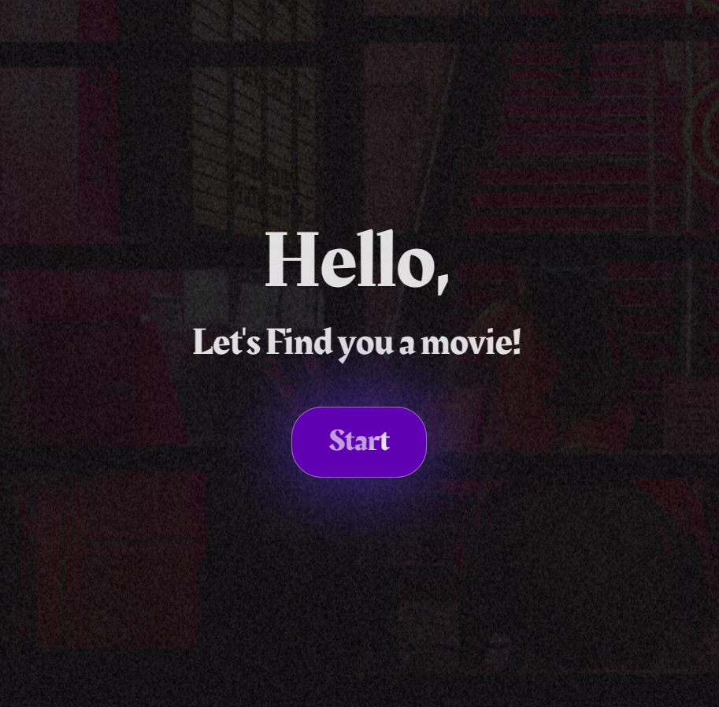
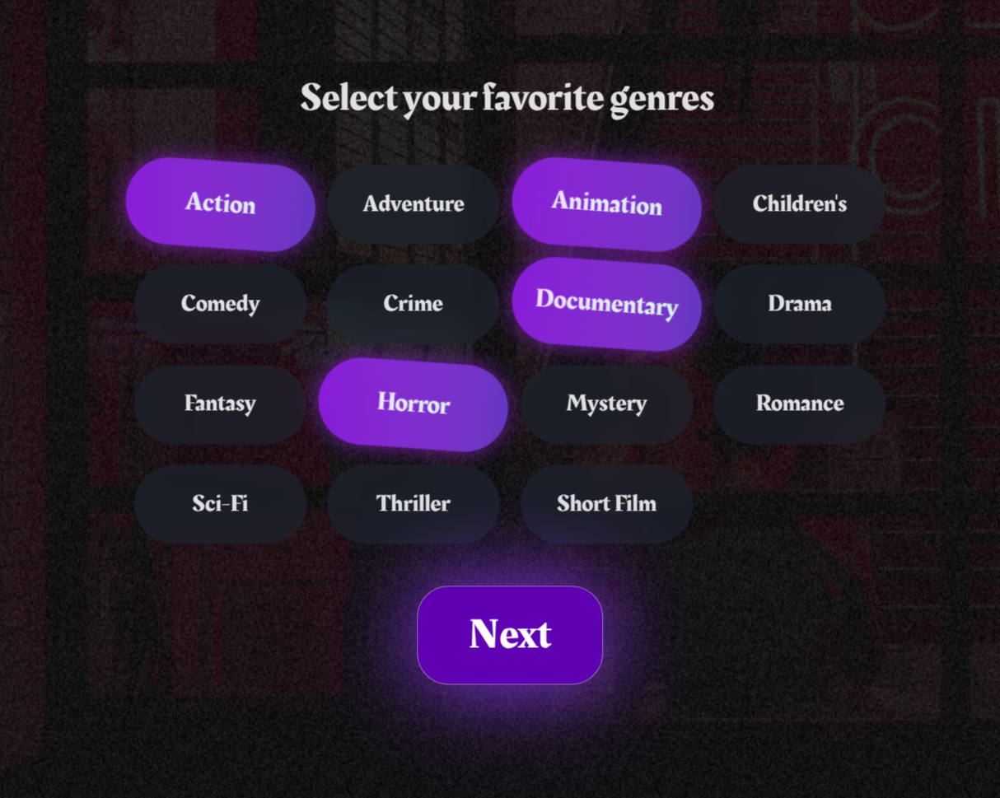
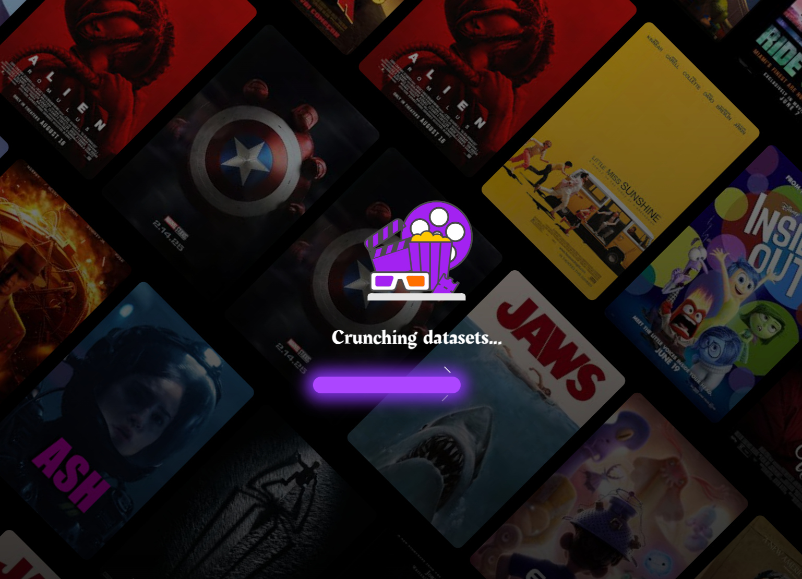
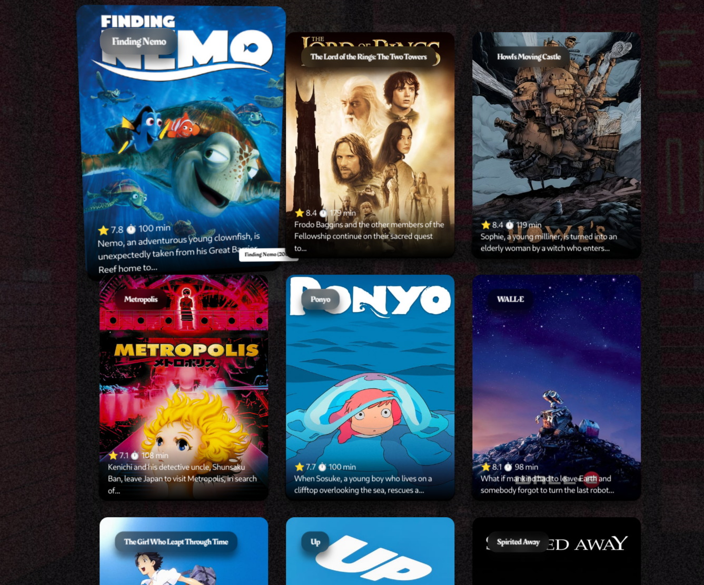

# Ai Movie Recommend Algorithm

## Live

- 


## Screenshots






## Table of Contents

1. [Introduction](#introduction)
2. [Features](#features)
3. [Technology Stack](#technology-stack)
4. [Project Structure](#project-structure)


## Introduction

Ai movie Recommendation based off Tensorflow pretrained for fast predections live, making it easy to find movies based off your taste  
## Features

- Responsive fully Animated design for various screen sizes
- Customizable recommendations
- Tensorflow Optimized pre-trained Model 
- Easy Movie redirection

## Technology Stack

### Frontend
- Vercell
- React Vite JS with eslint
- TMDB api for movie info
- axios

### Backend
- Railway
- Docker
- flask
- json
- random
- os
- tensorflow-cpu
- tabulate
- pandas
- flask
- pydantic
- numpy
- scikit-learn
- gunicorn


## Project Structure

```text
.
├── Ai-Backend
│   ├── content_item_train.csv
│   ├── content_item_train_header.txt
│   ├── content_item_vecs.csv
│   ├── content_movie_list.csv
│   ├── content_user_train.csv
│   ├── content_user_train_header.txt
│   ├── content_y_train.csv
│   ├── Dockerfile
│   ├── helper.py
│   ├── model.py
│   ├── notebook
│   │   └── Ai.ipynb
│   ├── prdiction.py
│   ├── README.md
│   ├── requirements.txt
│   └── trained_model.h5
├── Client
│   ├── eslint.config.js
│   ├── index.html
│   ├── LICENSE
│   ├── package.json
│   ├── package-lock.json
│   ├── public
│   │   └── posters
│   │       ├── 10.jpeg
│   │       ├── 11.jpeg
│   │       ├── 12.jpeg
│   │       ├── 13.jpeg
│   │       ├── 14.jpeg
│   │       ├── 15.jpeg
│   │       ├── 16.jpeg
│   │       ├── 17.jpeg
│   │       ├── 18.jpeg
│   │       ├── 19.jpeg
│   │       ├── 1.jpeg
│   │       ├── 20.jpeg
│   │       ├── 21.jpeg
│   │       ├── 22.jpeg
│   │       ├── 23.jpeg
│   │       ├── 24.jpeg
│   │       ├── 25.jpeg
│   │       ├── 2.jpeg
│   │       ├── 3.jpeg
│   │       ├── 4.jpeg
│   │       ├── 5.jpeg
│   │       ├── 6.jpeg
│   │       ├── 7.jpeg
│   │       ├── 8.jpeg
│   │       └── 9.jpeg
│   ├── README.md
│   ├── roadmap
│   ├── src
│   │   ├── App.css
│   │   ├── App.jsx
│   │   ├── assets
│   │   │   ├── cinema.jpeg
│   │   │   ├── fonts
│   │   │   │   └── Rakkas-Regular.ttf
│   │   │   └── lottie
│   │   │       └── YnS6Knvh0n.json
│   │   ├── components
│   │   │   ├── BlurText.jsx
│   │   │   ├── geners.jsx
│   │   │   ├── GridMotion.css
│   │   │   ├── GridMotion.jsx
│   │   │   ├── LoadingText.jsx
│   │   │   ├── multi.jsx
│   │   │   ├── Noise.css
│   │   │   ├── Noise.jsx
│   │   │   ├── Popcorn.jsx
│   │   │   ├── progess.jsx
│   │   │   ├── SplitText.jsx
│   │   │   └── TiltedCard.jsx
│   │   ├── index.css
│   │   ├── main.jsx
│   │   └── Movies.js
│   ├── vercel.json
│   └── vite.config.js
└── README.md

11 directories, 70 files
```

## Authors

- Noor Amjad - [GitHub](https://github.com/Justxd22) / [Twitter](https://twitter.com/_xd222) / [LinkedIn](https://www.linkedin.com/in/noor-amjad-xd)
- Ahmed Moustafa - [GitHub](https://github.com/AhmedMostafaDev12) / [Twitter](https://twitter.com/Ahmed_mostafaAI) / [LinkedIn](https://www.linkedin.com/in/ahmed-mostafa-4167912b8/)

## License

Copyright (C) 2024
Licensed under the GPLv3 License
